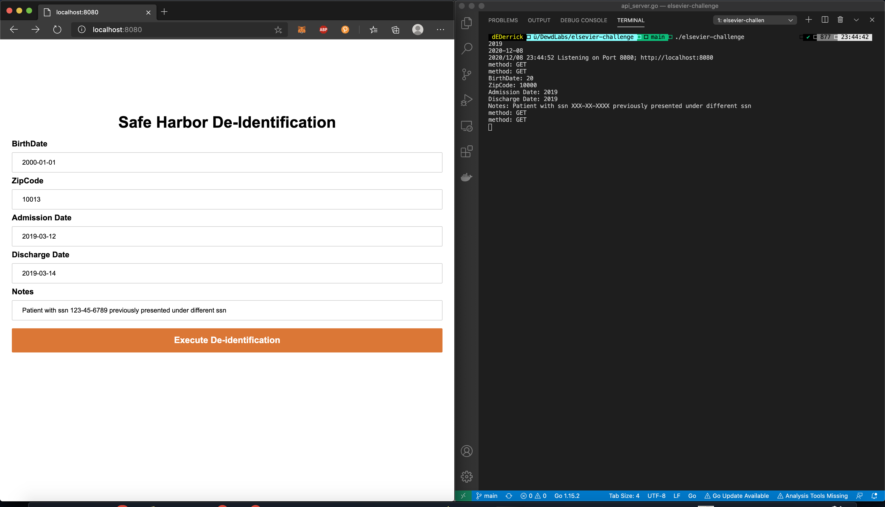

# Build and Run Instructions

## How to run the code

`cd` to \elsevier-challenge

Start server with `./elsevier-challenge` or `go run api_server.go`

Go to `http://localhost:8080` fill out the form and submit

The POST data will be logged in the console revealing the de-indentified information

## How to run the tests

run `go test ./... -v -cover` to run all unit tests

